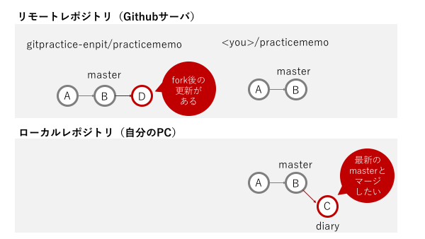
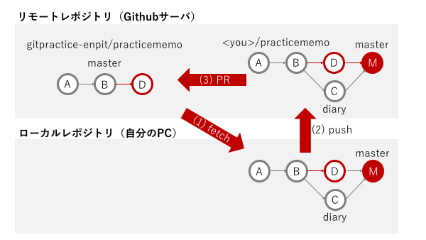

## Lesson6の状況解説

### 何をやっているのか
リポジトリをForkすると、その後Fork元が更新されたりして、Forkしてきたコードが古くなる場合があります。



ローカルリポジトリのブランチとマージするときは、その時masterを最新の状態にしてから
マージするようにしましょう。

### masterをfork元の最新状態と同期してマージする手順


1. fork元に名前をつける（ここではupstreamという名前をつけている）

  ```
% git remote add upstream https://github.com/....  
  ```
  
2. masterへ移動してfetchする
 
  ```
  % git checkout master
  % git fetch upstream
  ```
  
3. mergeする
 
  ```
  % git merge diary

  ```
リポジトリ