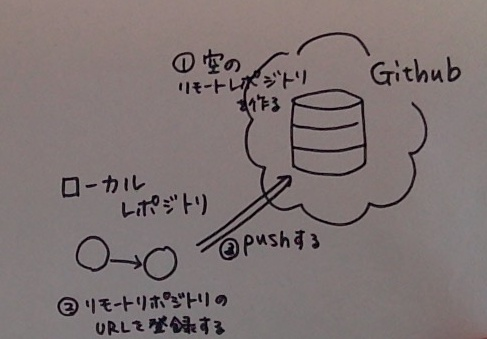
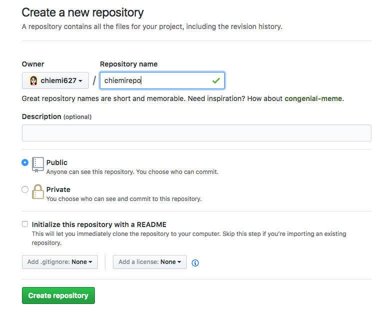
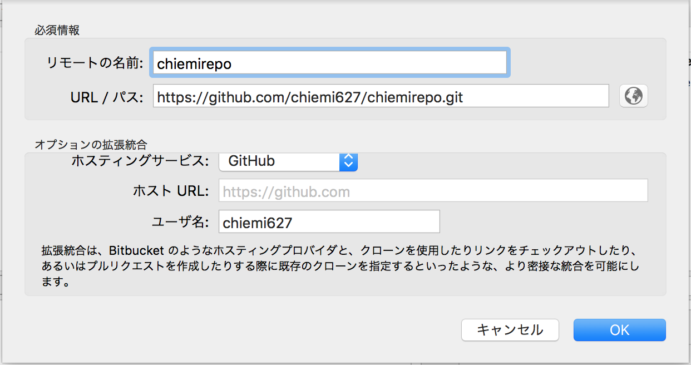
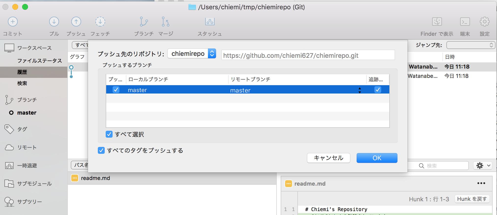

## ローカルレポジトリをGithubにあげる

1. 空のRepositoryをGithub上に作る
  * Githubページで右上の＋をクリックし、New repositoryを選択
  * レポジトリ名を入れてCreate repositoryボタンを押す
  * 
  * 作られたレポジトリのURLをコピーしておく

2. リモートレポジトリのURLを登録する
  * [リポジトリ]-[リポジトリ設定]を選択
  * リモートの名前を入力し、先ほどコピーしたURLを貼り付ける
  * 

3. ローカルレポジトリをプッシュする
  * プッシュボタンを押す
  * masterブランチを選択してOKを押す
  * 
